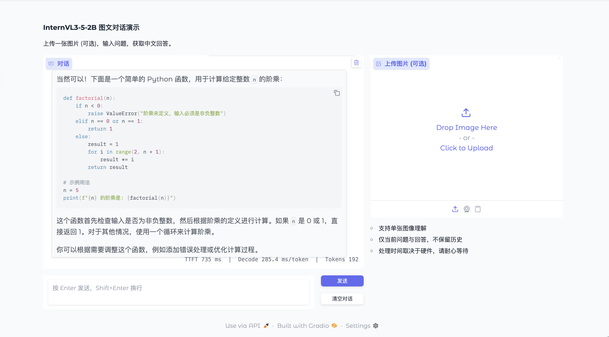
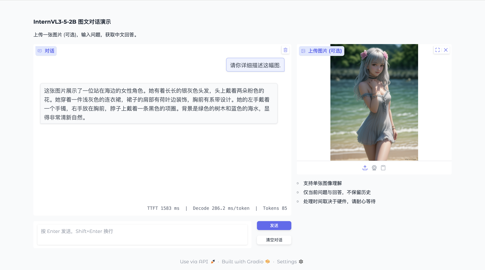

# InternVL3_5-2B.axera

> InternVL3_5-2B DEMO on Axera NPU.

- 目前支持 `Python` 语言, `C++` 代码在开发中.
- 预编译模型可以从 [HuggingFace](https://huggingface.co/AXERA-TECH/InternVL3_5-2B) 下载.
- 如需自行导出编译 `VIT` 模型请参考 [模型转换](/model_convert/README.md).

## 支持平台

- [x] AX650N
- [ ] AX630C

## Git Clone

首先使用如下命令 `clone` 本项目, 然后进入 `python` 文件夹:

```bash
$ git clone git@github.com:AXERA-TECH/InternVL3_5-2B.axera.git
$ cd InternVL3_5-2B.axera/python
```

之后在开发板上下载或安装以下支持库:

- 从 `huggingface` 下载 `InternVL3_5-2B` 模型.

    ```bash
    $ git clone https://huggingface.co/OpenGVLab/InternVL3_5-2B
    ```

- 在开发板上安装配置 `pyaxengine`, [点击跳转下载链接](https://github.com/AXERA-TECH/pyaxengine/releases). 注意板端 `SDK` 最低版本要求:

    - AX650 SDK >= 2.18
    - AX620E SDK >= 3.12
    - 执行 `pip3 install axengine-x.x.x-py3-none-any.whl` 安装

- 手动编译安装 `decord` 视频库 (如果不需要视频推理, 可不安装), 安装请参考 [decord-install-linux](https://github.com/dmlc/decord?tab=readme-ov-file#linux).

将下载后的预编译模型解压到当前文件夹[🔔可选], 默认文件夹排布如下:

```bash
(hf) ➜  python git:(main) ✗ tree .
.
├── examples
│   ├── image_0.jpg
│   ├── image_1.jpg
│   ├── image_2.png
│   ├── image_3.png
│   ├── laorenshuaidao.mp4
│   ├── red-panda.mp4
│   └── tuboshu.mp4
├── gradio_demo.py
├── infer_axmodel.py
├── infer_torch.py
├── InternVL3_5-2B
│   ├── added_tokens.json
│   ├── chat_template.jinja
│   ├── config.json
│   ├── configuration_intern_vit.py
│   ├── configuration_internvl_chat.py
│   ├── conversation.py
│   ├── generation_config.json
│   ├── merges.txt
│   ├── modeling_intern_vit.py
│   ├── modeling_internvl_chat.py
│   ├── model.safetensors
│   ├── preprocessor_config.json
│   ├── processor_config.json
│   ├── README.md
│   ├── special_tokens_map.json
│   ├── tokenizer_config.json
│   ├── tokenizer.json
│   ├── video_preprocessor_config.json
│   └── vocab.json
├── InternVL3_5-2B_axmodel
│   ├── model.embed_tokens.weight.bfloat16.bin
│   ├── model.embed_tokens.weight.float32.bin
│   ├── model.embed_tokens.weight.npy
│   ├── qwen3_p128_l0_together.axmodel
│   ├── qwen3_p128_l10_together.axmodel
│   ├── qwen3_p128_l11_together.axmodel
│   ├── qwen3_p128_l12_together.axmodel
│   ├── qwen3_p128_l13_together.axmodel
│   ├── qwen3_p128_l14_together.axmodel
│   ├── qwen3_p128_l15_together.axmodel
│   ├── qwen3_p128_l16_together.axmodel
│   ├── qwen3_p128_l17_together.axmodel
│   ├── qwen3_p128_l18_together.axmodel
│   ├── qwen3_p128_l19_together.axmodel
│   ├── qwen3_p128_l1_together.axmodel
│   ├── qwen3_p128_l20_together.axmodel
│   ├── qwen3_p128_l21_together.axmodel
│   ├── qwen3_p128_l22_together.axmodel
│   ├── qwen3_p128_l23_together.axmodel
│   ├── qwen3_p128_l24_together.axmodel
│   ├── qwen3_p128_l25_together.axmodel
│   ├── qwen3_p128_l26_together.axmodel
│   ├── qwen3_p128_l27_together.axmodel
│   ├── qwen3_p128_l2_together.axmodel
│   ├── qwen3_p128_l3_together.axmodel
│   ├── qwen3_p128_l4_together.axmodel
│   ├── qwen3_p128_l5_together.axmodel
│   ├── qwen3_p128_l6_together.axmodel
│   ├── qwen3_p128_l7_together.axmodel
│   ├── qwen3_p128_l8_together.axmodel
│   ├── qwen3_p128_l9_together.axmodel
│   └── qwen3_post.axmodel
├── utils
│   └── infer_func.py
└── vit-models
    └── internvl_vit_model_1x3x448x448.axmodel

5 directories, 63 files
```

## 模型转换

关于 `onnx` 和 `axmodel` 的导出、编译参见 [模型转换](./model_convert/README.md) 部分内容.

## 上板部署

- `AX650N` 的设备已预装 `Ubuntu 22.04`
- 以 `root` 权限登陆 `AX650N` 的板卡设备
- 接入互联网, 确保 `AX650N` 的设备能正常执行 `apt install`, `pip install` 等指令
- 已验证设备: `AX650N DEMO Board`、`爱芯派Pro(AX650N)`

### Python API 运行

#### Requirements

```bash
$ mkdir /opt/site-packages
$ cd python
$ pip3 install -r requirements.txt --prefix=/opt/site-packages
``` 

#### 添加环境变量

将以下两行添加到 `/root/.bashrc`(实际添加的路径需要自行检查)后, 重新连接终端或者执行 `source ~/.bashrc`

```bash
$ export PYTHONPATH=$PYTHONPATH:/opt/site-packages/local/lib/python3.10/dist-packages  
$ export PATH=$PATH:/opt/site-packages/local/bin
``` 

#### 运行

使用 `Gradio API` 交互式对话:

```bash
$ python3 gradio_demo.py --hf_model InternVL3_5-2B/ --axmodel_path InternVL3_5-2B_axmodel/ --vit_model vit-models/internvl_vit_model_1x3x448x448.axmodel
```

纯文本对话



图像理解



---

在 `Axera 开发板` 上运行以下命令开始聊天对话:

```sh
$ cd InternVL3_5-2B.axera/python
$ python3 infer_axmodel.py --hf_model InternVL3_5-2B/ --axmodel_path InternVL3_5-2B_axmodel/ --question "请计算函数[y=2x^2+2]的导数, 并提供 markdown 格式的推理过程"
```

输出结果如下:

```bash
[INFO] Compiler version: 5.1-dirty 0fdbfe15-dirty
Model loaded successfully!
slice_indices: [0]
Slice prefill done: 0
answer >> 要计算函数 \( y = 2x^2 + 2 \) 的导数，我们可以使用基本的微积分规则。导数表示函数在某一点的瞬时变化率，或者说是函数值随自变量变化的^@速率。

### ��理过程

1. **识别函数**：给定的函数是 \( y = 2x^2 + 2 \)。

2. **应用幂规则**：对于函数 \( y = ax^n \)，其导数为 \( y' = anx^{n-1} \)。

3. **计算每一项的导数**：
   - 对于 \( 2x^2 \)，应用幂规则，得到 \( 2 \times 2x^{2-1} = 4x \)。
   - 对于常数项 \( 2 \)，其导数为 \( 0 \)，因为常数的导数是0。

4. **合并结果**：将每一项的导数相加，得到 \( y' = 4x \)。

因此，函数 \( y = 2x^2 + 2 \) 的导数是 \( y' = 4x \)。

### 结论

函数 \( y = 2x^2 + 2 \) 的导数是 \( y' = 4x \)。
```

输入以下命令执行单图像理解任务:

```sh
$ cd InternVL3_5-2B.axera/python
$ python3 infer_axmodel.py --hf_model InternVL3_5-2B/ --axmodel_path InternVL3_5-2B_axmodel/ --question "请描述这幅图" -i examples/image_0.jpg --vit_model vit-models/internvl_vit_model_1x3x448x448.axmodel
```


模型推理结果如下:

```bash
[INFO] Model type: 2 (triple core)
[INFO] Compiler version: 5.1-dirty 0fdbfe15-dirty
Model loaded successfully!
slice_indices: [0, 1, 2]
Slice prefill done: 0
Slice prefill done: 1
Slice prefill done: 2
answer >> 这是一张红熊猫的照片。红熊猫是一种红棕色的哺乳动物，通常生活在亚洲的森林中。它们以捕食昆虫和小型无脊椎动物为生。图片中，红熊猫正坐在一个木制的平台上，背景是绿色的树木和植被，显得非常自然和生动。红熊猫的表情看起来很友好，似乎在观察或等待什么。
```

#### 推理耗时统计

该模型 prefill 阶段存在 9 个可用子图, 共 28 层 Decode Layer, 每个子图耗时如下:

```
g1: 8.583 ms
g2: 12.185 ms
g3: 15.757 ms
g4: 19.482 ms
g5: 22.974 ms
g6: 26.576 ms
g7: 30.371 ms
g8: 34.563 ms
g9: 37.655 ms
```

decode 阶段只有一个子图, 耗时如下:

```
g0: 3.181 ms
```

后处理耗时: 15.968 ms.

- 模型最大 TTFT 为: 208.146 * 28 + 15.968 约为 5844 ms.

- 模型解码速度为: 1000 / (3.181 * 28 + 15.968)  = 9.52 tokens/s.


## 技术讨论

- Github issues
- QQ 群: 139953715
